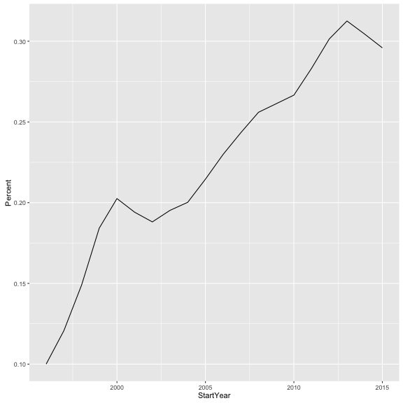
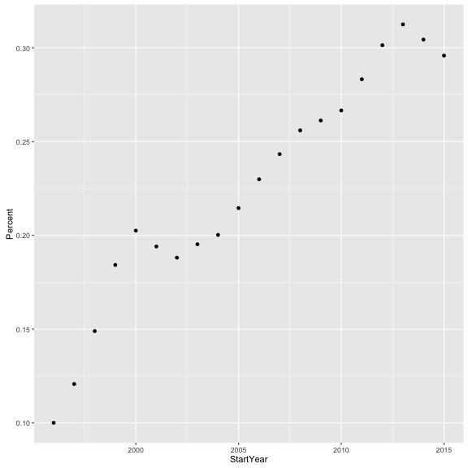
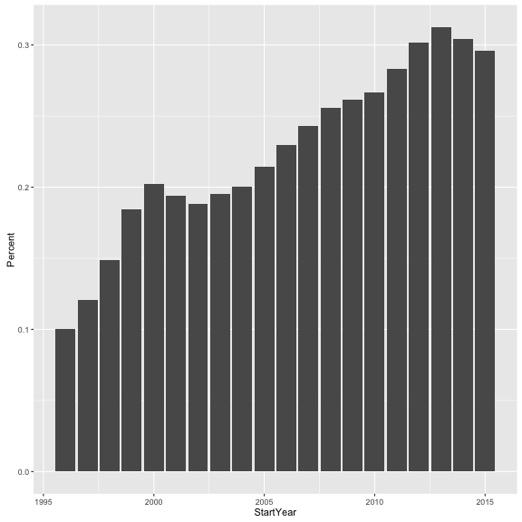
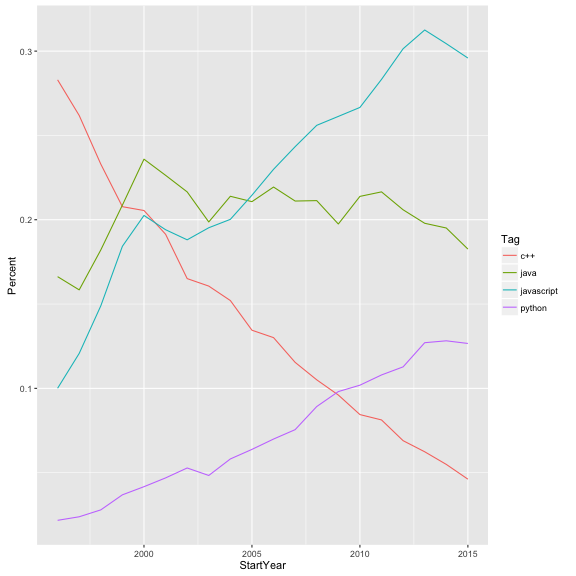
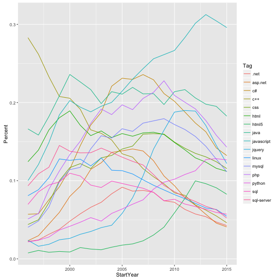
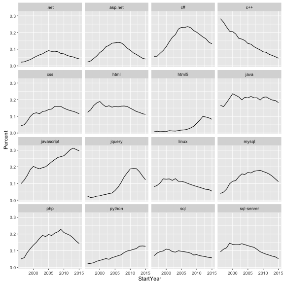
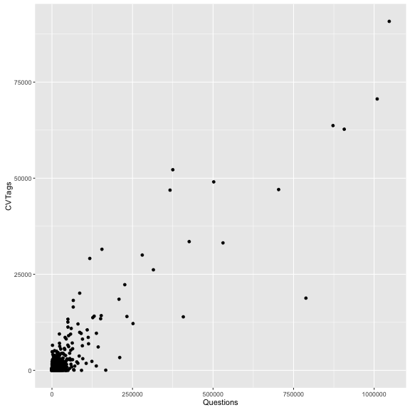
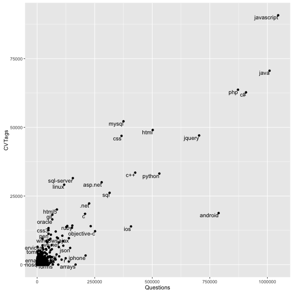
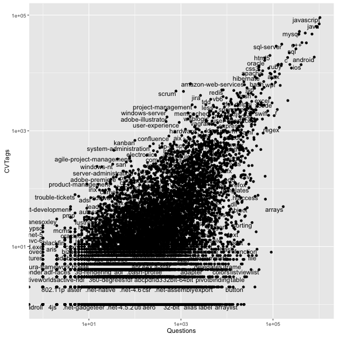
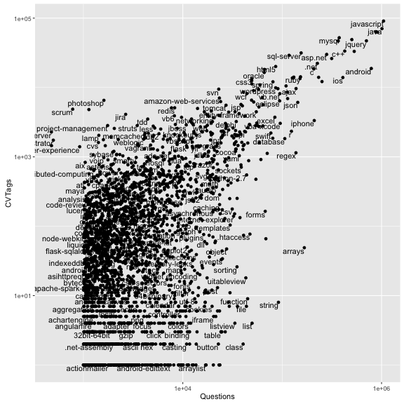

# Exploring Careers Data with sqlstackr, dplyr, and ggplot2


This is a basic tutorial showing how to use R to request, manipulate, and visualize information from the Careers database. This uses a combination of:

* [dplyr and tidyr](https://www.rstudio.com/wp-content/uploads/2015/02/data-wrangling-cheatsheet.pdf): a data manipulation and "wrangling" framework
* [ggplot2](http://www.rstudio.com/wp-content/uploads/2015/12/ggplot2-cheatsheet-2.0.pdf): visualization
* **sqlstackr**: custom internal tools for querying the Stack Overflow/Careers/etc databases.

This combination of packages is powerful for performing analyses and answering statistical questions about our data, especially involving statistical tests and graphics.

Before you do anything, you'll need to install a few packages. First, install the internal sqlstackr package. Also run the following line of R:


```r
install.packages(c("stringr", "tidyr", "ggplot2"))
```

### Getting data from Careers

Let's say I want to know some information about people's CV Sections: that is, the jobs on their resume. I could come up with a SQL query something like this:


```r
library(dplyr)
library(sqlstackr)

q <- "select Id, CVId, Name, Tags, StartYear, EndYear, IsCurrent from CVSections
        where CVSectionTypeId = 2 and
        StartYear is not null"

CV_sections <- query_Careers(q, collect = TRUE)
```

This `query_Careers` function is sqlstackr's function for sending a SQL query to the Careers database. (If you're wondering, there's also `query_StackOverflow`, `query_HAProxyLogs`, `query_Calculon`, and so on). `collect = TRUE` tells the function to bring the results of the query in memory into R (otherwise it will just supply a preview).

Now, if you print this (by putting `CV_sections` into your terminal) you'll see the first few rows:


```r
CV_sections
```

```
## Source: local data frame [540,310 x 7]
## 
##       Id  CVId                               Name
##    (int) (int)                              (chr)
## 1      2     1                             Intern
## 2      6     3               Technical Evangelist
## 3      8     4                    Marathon Runner
## 4     14     7                         Chief Geek
## 5     18     9                  Software Engineer
## 6     28    13                  Software Engineer
## 7     32    15                         Programmer
## 8     36    17                     Lead Developer
## 9     38    18 Senior Electrical Project Engineer
## 10    40    19                     .NET Developer
## ..   ...   ...                                ...
## Variables not shown: Tags (chr), StartYear (int), EndYear (int), IsCurrent
##   (lgl)
```

This is a **data frame**, which is the most common data type in R you'll be working with. You can also view it like an spreadsheet by doing:


```r
View(CV_sections)
```

#### Data cleaning with filter and mutate

Before we do any analysis, we usually have to do a bit of data-cleaning. We'll do this with functions from the dplyr package.

One data cleaning issue is that people put really wacky years for their Start and End dates, like "1754" or "2110". This will mess with our analyses and graphs. Let's limit it to a range where most of our valid resume items are. We can do this with `filter`, which filters for particular rows of the table based on a condition (like a "where" statement in SQL or LINQ):


```r
cleaned <- filter(CV_sections, StartYear >= 1996, StartYear < 2016)
cleaned
```

```
## Source: local data frame [525,643 x 7]
## 
##       Id  CVId                               Name
##    (int) (int)                              (chr)
## 1      2     1                             Intern
## 2      6     3               Technical Evangelist
## 3      8     4                    Marathon Runner
## 4     14     7                         Chief Geek
## 5     18     9                  Software Engineer
## 6     32    15                         Programmer
## 7     36    17                     Lead Developer
## 8     38    18 Senior Electrical Project Engineer
## 9     40    19                     .NET Developer
## 10    42    20                     Student Mentor
## ..   ...   ...                                ...
## Variables not shown: Tags (chr), StartYear (int), EndYear (int), IsCurrent
##   (lgl)
```

(We omit 2016 since it's early in the year and results will be unusual). Notice that before there were 540310 rows, but now there are 525643 rows.

You should get into the habit of writing this function call a different way:


```r
CV_sections %>%
  filter(StartYear >= 1996, StartYear < 2016)
```

```
## Source: local data frame [525,643 x 7]
## 
##       Id  CVId                               Name
##    (int) (int)                              (chr)
## 1      2     1                             Intern
## 2      6     3               Technical Evangelist
## 3      8     4                    Marathon Runner
## 4     14     7                         Chief Geek
## 5     18     9                  Software Engineer
## 6     32    15                         Programmer
## 7     36    17                     Lead Developer
## 8     38    18 Senior Electrical Project Engineer
## 9     40    19                     .NET Developer
## 10    42    20                     Student Mentor
## ..   ...   ...                                ...
## Variables not shown: Tags (chr), StartYear (int), EndYear (int), IsCurrent
##   (lgl)
```

This `%>%` comes with dplyr and is called a "pipe operator": it simply means "insert the `CV_sections` object as the first argument of `count`. Why do this? Because it allows us to chain many dplyr operations together: without having nested functions. You'll see this become useful soon.

Another data-cleaning issue is that there is sometimes trailing or leading whitespace in the names, Also, there's inconsistent capitalization: someone may write `Software Engineer` while others write `Software engineer`. So let's trim the whitespace and turn everything lowercase.

This involves adding another useful package, stringr (for string manipulations), and using another dplyr function, `mutate`. `mutate` alters a column of a data frame, or adds a new one.


```r
library(stringr)

cleaned <- CV_sections %>%
  filter(StartYear >= 1996, StartYear < 2016) %>%
  mutate(Name = str_trim(str_to_lower(Name)))

cleaned
```

```
## Source: local data frame [525,643 x 7]
## 
##       Id  CVId                               Name
##    (int) (int)                              (chr)
## 1      2     1                             intern
## 2      6     3               technical evangelist
## 3      8     4                    marathon runner
## 4     14     7                         chief geek
## 5     18     9                  software engineer
## 6     32    15                         programmer
## 7     36    17                     lead developer
## 8     38    18 senior electrical project engineer
## 9     40    19                     .net developer
## 10    42    20                     student mentor
## ..   ...   ...                                ...
## Variables not shown: Tags (chr), StartYear (int), EndYear (int), IsCurrent
##   (lgl)
```

`str_trim` trims whitespace, and `str_to_lower` turns it lowercase. From now on, we'll be using the `cleaned` dataset in our analyses.

### Summarizing data with count and group_by/summarize

Now that we have a clean dataset, let's start with a simple question. What are the most common job titles? We can answer that with the `count` function from the `dplyr` package.


```r
cleaned %>%
  count(Name, sort = TRUE)
```

```
## Source: local data frame [132,879 x 2]
## 
##                         Name     n
##                        (chr) (int)
## 1          software engineer 35467
## 2         software developer 25624
## 3              web developer 19155
## 4   senior software engineer 12699
## 5                  developer 11604
## 6           senior developer  5605
## 7                 consultant  5128
## 8                 programmer  5107
## 9  senior software developer  4808
## 10                    intern  4119
## ..                       ...   ...
```

This aggregates the data frame into the unique values of `Name`, sorting so that the most common are first. Notice that we wanted to count the `Name` column, but we didn't put `Name` in quotes.

Similarly, if we'd wanted to count the number of jobs started in each year, we could have done:


```r
cleaned %>%
  count(StartYear, sort = TRUE)
```

```
## Source: local data frame [20 x 2]
## 
##    StartYear     n
##        (int) (int)
## 1       2011 56673
## 2       2012 55948
## 3       2010 50253
## 4       2013 48187
## 5       2014 39541
## 6       2009 38607
## 7       2008 38480
## 8       2007 34795
## 9       2006 28114
## 10      2015 22945
## 11      2005 22944
## 12      2004 17676
## 13      2003 13443
## 14      2000 11661
## 15      2001 11092
## 16      2002 10971
## 17      1999  8435
## 18      1998  6690
## 19      1997  5208
## 20      1996  3980
```

### Breaking up tag data

In my [1/29/16 Tiny Talk](https://www.youtube.com/watch?v=wgzeTNWrFD4&feature=youtu.be), I did some analyses of how tags have grown or shrunk in popularity over the last twenty years. Let's reproduce a simple version of that analysis.

First of all, you don't need all the columns, just the CV section ID, the starting year, and the vector of tags. This is done with the `select` function in dplyr: 


```r
cleaned %>%
  select(Id, StartYear, Tags)
```

```
## Source: local data frame [525,643 x 3]
## 
##       Id StartYear
##    (int)     (int)
## 1      2      2001
## 2      6      2005
## 3      8      2004
## 4     14      2008
## 5     18      2008
## 6     32      2008
## 7     36      2000
## 8     38      2005
## 9     40      2007
## 10    42      2005
## ..   ...       ...
## Variables not shown: Tags (chr)
```

Notice that just like SQL's SELECT, dplyr's `select` extracts only specified *columns* from a dataset. Note also that some jobs have no tags, so for this analysis we filter them out:


```r
cleaned %>%
  select(Id, StartYear, Tags) %>%
  filter(Tags != "")
```

```
## Source: local data frame [342,883 x 3]
## 
##       Id StartYear
##    (int)     (int)
## 1      2      2001
## 2      6      2005
## 3      8      2004
## 4     14      2008
## 5     18      2008
## 6     32      2008
## 7     36      2000
## 8     38      2005
## 9     40      2007
## 10    42      2005
## ..   ...       ...
## Variables not shown: Tags (chr)
```

Now, right now all the tags are combined together within each string, which makes it impossible to count them over time. We want to reorganize the data frame so that there's one-row-per-tag-per-cv. This requires the help of the tidyr package.


```r
library(tidyr)

by_tag <- cleaned %>%
  select(Id, StartYear, Tags) %>%
  filter(Tags != "") %>%
  mutate(Tags = str_split(Tags, " ")) %>%
  unnest(Tags) %>%
  rename(Tag = Tags)

by_tag
```

```
## Source: local data frame [2,159,204 x 3]
## 
##       Id StartYear         Tag
##    (int)     (int)       (chr)
## 1      2      2001     asp.net
## 2      2      2001      vb.net
## 3      2      2001      oracle
## 4      2      2001        html
## 5      2      2001  javascript
## 6      6      2005 silverlight
## 7      6      2005          c#
## 8      6      2005     asp.net
## 9      8      2004     insoles
## 10    14      2008    facebook
## ..   ...       ...         ...
```

That pair of steps- `mutate/str_split` and then `unnest`- function is a little like LINQ's `SelectMany`. We split each string into a vector around the " " character, then we "unnested" them to make an even taller data frame (notice there are now 2159204 rows). The last thing I did is `rename` the column from `Tags` to `Tag` since it is no longer plural.

We now have a data frame that has one-row-per-tag-per-CV, along with the starting year of that CV. For starters, we can simply ask what the most common tags on CVs are!


```r
tag_counts <- by_tag %>%
  count(Tag, sort = TRUE)

tag_counts
```

```
## Source: local data frame [43,719 x 2]
## 
##           Tag     n
##         (chr) (int)
## 1  javascript 90806
## 2        java 70615
## 3         php 63695
## 4          c# 62744
## 5       mysql 52205
## 6        html 49043
## 7      jquery 47043
## 8         css 46893
## 9         c++ 33510
## 10     python 33168
## ..        ...   ...
```

This isn't so far from the most common tags on Stack Overflow. We'll take a look into that later.

### Tags fraction in year


```r
tags_by_year <- by_tag %>%
  count(StartYear, Tag)

tags_by_year
```

```
## Source: local data frame [142,520 x 3]
## Groups: StartYear [?]
## 
##    StartYear           Tag     n
##        (int)         (chr) (int)
## 1       1996          .net    44
## 2       1996      .net-1.0     1
## 3       1996      .net-2.0     1
## 4       1996 .net-remoting     1
## 5       1996        .netcf     1
## 6       1996           1.0     1
## 7       1996           1.1     1
## 8       1996        1.x2.x     1
## 9       1996             2     2
## 10      1996           2.0     1
## ..       ...           ...   ...
```

Knowing that there were 44 jobs starting in 1996 with the .net tag is interesting, but it's not what we really want to view. We want to know the fraction of jobs that year that contained this tag.

This means we'll have to do a bit more interesting summarization, using `group_by`. This works a little like SQL's GROUP BY. If we follow it with a `mutate`, the `mutate` will occur once for each unique group:


```r
by_tag %>%
  group_by(StartYear) %>%
  mutate(YearTotal = n_distinct(Id))
```

```
## Source: local data frame [2,159,204 x 4]
## Groups: StartYear [20]
## 
##       Id StartYear         Tag YearTotal
##    (int)     (int)       (chr)     (int)
## 1      2      2001     asp.net      5951
## 2      2      2001      vb.net      5951
## 3      2      2001      oracle      5951
## 4      2      2001        html      5951
## 5      2      2001  javascript      5951
## 6      6      2005 silverlight     13088
## 7      6      2005          c#     13088
## 8      6      2005     asp.net     13088
## 9      8      2004     insoles      9719
## 10    14      2008    facebook     23540
## ..   ...       ...         ...       ...
```

The `n_distinct` function tells how many distinct values of `CVId` are in each group (each year). That's the data we'll need, so we count from there:


```r
tags_by_year <- by_tag %>%
  group_by(StartYear) %>%
  mutate(YearTotal = n_distinct(Id)) %>%
  count(StartYear, YearTotal, Tag) %>%
  mutate(Percent = n / YearTotal)

tags_by_year
```

```
## Source: local data frame [142,520 x 5]
## Groups: StartYear, YearTotal [20]
## 
##    StartYear YearTotal           Tag     n      Percent
##        (int)     (int)         (chr) (int)        (dbl)
## 1       1996      1979          .net    44 0.0222334512
## 2       1996      1979      .net-1.0     1 0.0005053057
## 3       1996      1979      .net-2.0     1 0.0005053057
## 4       1996      1979 .net-remoting     1 0.0005053057
## 5       1996      1979        .netcf     1 0.0005053057
## 6       1996      1979           1.0     1 0.0005053057
## 7       1996      1979           1.1     1 0.0005053057
## 8       1996      1979        1.x2.x     1 0.0005053057
## 9       1996      1979             2     2 0.0010106114
## 10      1996      1979           2.0     1 0.0005053057
## ..       ...       ...           ...   ...          ...
```

Now we have the percentage of jobs in each year with that tag. Now we can actually make some graphs.

### Visualizing tags over time

This is far too much data to look at manually. But we can start by picking a programming language, and filtering just for it.


```r
js_tag <- tags_by_year %>%
  filter(Tag == "javascript")

js_tag
```

```
## Source: local data frame [20 x 5]
## Groups: StartYear, YearTotal [20]
## 
##    StartYear YearTotal        Tag     n   Percent
##        (int)     (int)      (chr) (int)     (dbl)
## 1       1996      1979 javascript   198 0.1000505
## 2       1997      2601 javascript   314 0.1207228
## 3       1998      3438 javascript   512 0.1489238
## 4       1999      4342 javascript   800 0.1842469
## 5       2000      6142 javascript  1244 0.2025399
## 6       2001      5951 javascript  1155 0.1940850
## 7       2002      5912 javascript  1112 0.1880920
## 8       2003      7283 javascript  1422 0.1952492
## 9       2004      9719 javascript  1946 0.2002264
## 10      2005     13088 javascript  2808 0.2145477
## 11      2006     16259 javascript  3738 0.2299034
## 12      2007     20873 javascript  5079 0.2433287
## 13      2008     23540 javascript  6026 0.2559898
## 14      2009     23928 javascript  6252 0.2612839
## 15      2010     32411 javascript  8641 0.2666070
## 16      2011     38046 javascript 10776 0.2832361
## 17      2012     39976 javascript 12049 0.3014058
## 18      2013     36483 javascript 11402 0.3125291
## 19      2014     31405 javascript  9560 0.3044101
## 20      2015     19507 javascript  5772 0.2958938
```

Looking at this manually we can start to see a pattern. But it is much easier to visualize it. To do this, we use `ggplot2`.


```r
library(ggplot2)
ggplot(js_tag, aes(x = StartYear, y = Percent)) +
  geom_line()
```



There are three parts to a ggplot2 call:

* **data being plotted**: in this case, the `js_tag` data frame we had just created
* **mapping of attributes in the data to aesthetic elements the graph**: this is defined by `aes(x = StartYear, y = Percent)`. This tells the graph the variables from the data frame that we want on the x and y axes.
* **layers**: in this case, we add (`+`) a `geom_point()` layer. This tells it we want a line plot, which is appropriate for showing a changing trend over time. If we had instead wanted a scatter plot, we could have done:


```r
ggplot(js_tag, aes(x = StartYear, y = Percent)) +
  geom_point()
```



Or a bar plot with:


```r
ggplot(js_tag, aes(x = StartYear, y = Percent)) +
  geom_bar(stat = "identity")
```



(Don't worry about `stat = "identity"` for now, it's just telling ggplot2 that we want a bar plot rather than a histogram). That's just plotting one single tag. We could filter for multiple tags using the `%in%` operator:


```r
multiple_tags <- tags_by_year %>%
  filter(Tag %in% c("javascript", "python", "java", "c++"))

multiple_tags
```

```
## Source: local data frame [80 x 5]
## Groups: StartYear, YearTotal [20]
## 
##    StartYear YearTotal        Tag     n    Percent
##        (int)     (int)      (chr) (int)      (dbl)
## 1       1996      1979        c++   560 0.28297120
## 2       1996      1979       java   329 0.16624558
## 3       1996      1979 javascript   198 0.10005053
## 4       1996      1979     python    43 0.02172815
## 5       1997      2601        c++   681 0.26182238
## 6       1997      2601       java   412 0.15840062
## 7       1997      2601 javascript   314 0.12072280
## 8       1997      2601     python    62 0.02383699
## 9       1998      3438        c++   801 0.23298429
## 10      1998      3438       java   626 0.18208261
## ..       ...       ...        ...   ...        ...
```

(`c("javascript", "python"...)` defines a character vector, since `c` stands for "combine"). If we want to plot this, we have to separate these four tags from each other in some way. Let's choose to distinguish them with color:


```r
ggplot(multiple_tags, aes(StartYear, Percent, color = Tag)) +
  geom_line()
```



Suppose instead of just choosing four tags, we want to plot a bunch of the most common- say, all the ones that appear on more than 20,000 jobs.


```r
common_tags <- tags_by_year %>%
  group_by(Tag) %>%
  mutate(TagTotal = sum(n)) %>%
  ungroup() %>%
  filter(TagTotal > 20000)

common_tags
```

```
## Source: local data frame [320 x 6]
## 
##    StartYear YearTotal        Tag     n     Percent TagTotal
##        (int)     (int)      (chr) (int)       (dbl)    (int)
## 1       1996      1979       .net    44 0.022233451    22296
## 2       1996      1979    asp.net    46 0.023244063    30008
## 3       1996      1979         c#   113 0.057099545    62744
## 4       1996      1979        c++   560 0.282971198    33510
## 5       1996      1979        css    87 0.043961597    46893
## 6       1996      1979       html   246 0.124305205    49043
## 7       1996      1979      html5    15 0.007579586    20090
## 8       1996      1979       java   329 0.166245579    70615
## 9       1996      1979 javascript   198 0.100050531    90806
## 10      1996      1979     jquery    47 0.023749368    47043
## ..       ...       ...        ...   ...         ...      ...
```


```r
ggplot(common_tags, aes(StartYear, Percent, color = Tag)) +
  geom_line()
```



The color legend was useful when we had four lines, but now they're almost impossible to tell apart, and we have to make a different visualization choice. Let's instead create a sub-graph for each tag.


```r
ggplot(common_tags, aes(StartYear, Percent)) +
  geom_line() +
  facet_wrap(~Tag)
```



This is getting us much closer to the analysis we're looking for. In future tutorials, we may look at coming up with the network and coloring it in based on growth rates.

### Joining tables together

Let's move on to a different topic. Suppose we wanted to compare how common tags are on CVs as opposed to questions on Stack Overflow. Earlier we used `query_Careers` to send a SQL request to Careers. Similarly, we can use `query_StackOverflow` to send a SQL request to the Stack Overflow database:


```r
SO_tags <- query_StackOverflow("select Name as Tag, Count as Questions from Tags",
                               collect = TRUE)

SO_tags
```

```
## Source: local data frame [43,940 x 2]
## 
##                 Tag Questions
##               (chr)     (int)
## 1                .a        82
## 2              .app        92
## 3         .aspxauth        48
## 4     .bash-profile       390
## 5       .class-file       181
## 6          .cs-file        34
## 7              .doc       107
## 8              .emf        58
## 9  .git-info-grafts         3
## 10          .hgtags         7
## ..              ...       ...
```

Notice that in the SQL query I named the columns informatively as `Tag` (to match our other table) and `Questions`. We now have one table showing the number of SO questions per tag, and another showing appearances on `CVs`. We can use dplyr's `inner_join` to combine them, much like a SQL JOIN statement:


```r
tag_counts_joined <- tag_counts %>%
  rename(CVTags = n) %>%
  inner_join(SO_tags, by = "Tag")

tag_counts_joined
```

```
## Source: local data frame [16,435 x 3]
## 
##           Tag CVTags Questions
##         (chr)  (int)     (int)
## 1  javascript  90806   1046896
## 2        java  70615   1009502
## 3         php  63695    872316
## 4          c#  62744    907234
## 5       mysql  52205    375010
## 6        html  49043    502082
## 7      jquery  47043    703534
## 8         css  46893    366481
## 9         c++  33510    425925
## 10     python  33168    530805
## ..        ...    ...       ...
```

(Note that I renamed `n` to `CVTags` before joining to make this comparison table more informative).

### Visualizing data

We've again reached a step where looking at the first few rows of a table is insufficient to make conclusions. That's when it's time to start plotting.


```r
library(ggplot2)
ggplot(tag_counts_joined, aes(x = Questions, y = CVTags)) +
  geom_point()
```



Just like that, we have a scatterplot of number of SO questions vs number of CV tags. But we don't know which point is which. So let's add a second layer to the plot, a `geom_text` layer: 


```r
ggplot(tag_counts_joined, aes(x = Questions, y = CVTags)) +
  geom_point() +
  geom_text(aes(label = Tag), vjust = 1, hjust = 1, check_overlap = TRUE)
```



Notice that we defined a new aesthetic mapping for this layer: we want the `label` on each of the points to be based on the `Tag` column of the data. We also set three options: `vjust` and `hjust` told it to go slightly to the left and below each point (rather than on top of it), and `check_overlap = TRUE` told it not to add two labels if they would be on top of each other.

One problem with this graph is that *so much* of the interesting stuff is crammed into the lower left corner. So we make another change.


```r
ggplot(tag_counts_joined, aes(Questions, CVTags)) +
  geom_point() +
  geom_text(aes(label = Tag), vjust = 1, hjust = 1, check_overlap = TRUE)  +
  scale_x_log10() +
  scale_y_log10()
```



The `scale_x_log10()` and `scale_y_log10()` are not extra layers, they are options that change the nature of the plot. In this case, they put both x and y on a log scale.

There's still a lot of this plot taken up with points/tags we don't care about- ones with only a couple of questions or a couple of tags. So we remove all those that don't have at least 1000 SO questions and 1000 CV tags.


```r
tag_counts_common <- tag_counts_joined %>%
  filter(Questions > 1000 | CVTags > 1000)

ggplot(tag_counts_common, aes(Questions, CVTags)) +
  geom_point() +
  geom_text(aes(label = Tag), vjust = 1, hjust = 1, check_overlap = TRUE)  +
  scale_x_log10() +
  scale_y_log10()
```



There's some insights we can gain from this. As one example, there are far more `r` questions than `amazon-web-services` on SO, but more `amazon-web-services` tags on CVs. (I suspect this is because SO is often visited by academics and scientists, while Careers CVs are made up mostly of software developers). Some project management techniques like `scrum` have many appearances in jobs but very few SO questions, while technical ones like `file`, `string`, and `list` have many questions but almost no CV tags.

### Conclusions

One question I get from developers is "Why use R to analyze databases when you can just use SQL queries?" Notice, indeed, that much of the dplyr syntax mirrors SQL operations.

Well, here's some ways this analysis was possible only in R:

* Our `unnest` step to separate tags in CVSections. This kind of string parsing and reshaping would have been quite challenging to do in SQL alone, but was absolutely necessary to start counting tags per year.
* Our `inner_join`, since StackOverflow and Careers live on different databases and even servers, so joining them in SQL is not straightforward. This is just the start of the data integration we can do: we could even have brought in JSON or XML information that could never plausibly have made it into a SQL query.
* Plotting: ggplot2 offers more customization and control than even the best SQL-graphing frontends.

We didn't even start using the statistical analysis tools, including modeling and machine learning methods, that are present in R.
